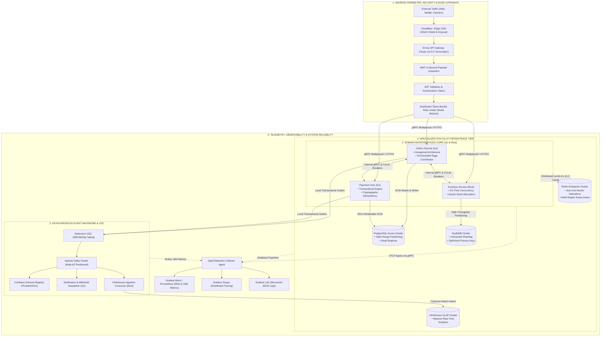

# 👨‍💻 Ariel Cusipuma Ortega
### **SENIOR BACKEND ENGINEER | HIGH-CONCURRENCY DISTRIBUTED SYSTEMS & LOW-LATENCY APIS**

  <a href="#summary"><b>Summary</b></a> •
  <a href="#philosophy"><b>Philosophy</b></a> •
  <a href="#stack"><b>Tech Stack</b></a> •
  <a href="#architecture"><b>Architecture</b></a> •
  <a href="#governance"><b>Governance</b></a> •
  <a href="#contact"><b>Contact</b></a>

---

 

 

## 🧭 Executive Summary

> *"Backend engineering excellence lies in mastering the physical limits of compute and network: eliminating unneeded memory allocations, guaranteeing bulletproof transactional consistency without locking bottlenecks, and orchestrating asynchronous workflows that never drop a single byte."*

I am **Ariel Cusipuma Ortega**, a **Senior Backend Engineer** specializing in designing and implementing high-throughput distributed cores, domain-driven microservices, and mission-critical transactional platforms. My core focus centers on sub-3ms p99 APIs engineered in **Go**, **Rust**, and **Java**, backed by event-driven topologies with **Apache Kafka**, **gRPC**, and fine-tuned polyglot storage (**PostgreSQL**, **ScyllaDB**, **Redis**, **ClickHouse**).

I possess deep expertise in tackling high-concurrency challenges, distributed consensus algorithms, distributed saga patterns, and kernel/socket-level network buffer optimizations.

---

## 🏛️ Backend Design Philosophy

```mermaid
flowchart TD
    Core["BACKEND RESILIENCE MATRIX: CORE DESIGN PILLARS"]

    subgraph P1["1. Asynchronous by Default"]
        A1["Producers & Inbound Commands"] -->|"UUID v7 + Idempotency Key"| A2["Atomic Deduplication in Redis"]
        A2 --> A3["Event Brokers: Apache Kafka & RabbitMQ"]
        A3 --> A4["Idempotent Consumer Groups & Dead-Letter Queues"]
    end

    subgraph P2["2. Immutable State Architecture"]
        B1["Business Domain Mutations"] --> B2["ACID Transactions in PostgreSQL"]
        B2 --> B3["Append-Only Double-Entry Ledger Tables"]
        B3 --> B4["CDC via Debezium to Transactional Outbox"]
    end

    subgraph P3["3. Zero-Locking Concurrency Flow"]
        C1["High-Throughput Concurrent Traffic"] --> C2["LMAX Disruptor & Ring Buffers in Go/Rust"]
        C2 --> C3["Atomic Compare-And-Swap (CAS) Primitives"]
        C3 --> C4["GC-Free Hot Paths & Zero-Allocation Memory Pools"]
    end

    subgraph P4["4. Observability & Telemetry First"]
        D1["Inbound API Ingress"] --> D2["RED Metrics: Rate, Errors, Duration"]
        D2 --> D3["USE Signals: Host Utilization, Saturation, Socket Errors"]
        D3 --> D4["OpenTelemetry Distributed Tracing & W3C Context Propagation"]
    end

    Core --> P1
    Core --> P2
    Core --> P3
    Core --> P4
```

1. **Native Idempotency & Async Decoupling**: Every external command is inherently idempotent using UUID keys and cryptographic hashes stored in Redis.
2. **Domain-Driven Clean Architecture**: Strict decoupling of domain business logic from volatile infrastructure mechanisms (databases, message queues, transport protocols).
3. **Purpose-Built Polyglot Persistence**: No one-size-fits-all database. PostgreSQL handles strict relational ACID; ScyllaDB handles high-volume partitioned time-series; Redis powers sub-millisecond atomic memory operations; ClickHouse handles real-time OLAP aggregations.
4. **Resilience via Isolation**: External dependencies are isolated through token-bucket rate limiters, exponential backoff with jitter, and adaptive circuit breakers.

---

### 🎯 The 4 Pillars of Technical Execution & Leadership

1. **First-Principles & Domain Architecture (SAD & DDD)**: Deconstruction of problems down to bare physics (CPU caches, memory hierarchy, TCP/QUIC socket saturation, CAP/PACELC theorems). Formalized through Software Architecture Documents (SAD), C4 models, and Event Storming guided by RFCs and Architecture Decision Records (ADRs) prior to writing code.
2. **Vertical Extreme Ownership (From Kernel to API)**: Comprehensive technical accountability across the entire backend slice. From Linux kernel internals (eBPF probes, SO_REUSEPORT socket tuning, Zero-Copy mechanics, and Kubernetes cgroups isolation) to distributed microservice cores, outbox event buses, down to externalized binary API contracts (gRPC/Protobuf, low-latency BFFs, and sub-3ms SLA guarantees).
3. **Lean Reliability & Team Multiplier**: Elimination of performative bureaucracy; continuous iteration driven by 1-day feedback loops, Trunk-Based Development, and elite DORA metrics (multiple daily deployments, Lead Time < 1h, MTTR < 15 min). Force-multiplier leadership: rigorous technical mentoring, incident de-escalation via Blameless Post-Mortems, and a high psychological safety engineering culture.
4. **Compound AI Leverage & Backend Scale**: Native integration of AI throughout the backend engineering lifecycle: autonomous coding agents for mutation test synthesis and monolithic refactoring, enterprise-grade vector RAG engines with low-latency vector retrieval, and predictive observability via LLMOps, drastically optimizing cost-per-transaction and expanding overall business scale.

---

## 🛠️ Technological Arsenal & Skills Matrix

### Core Languages & Runtimes

### APIs, Messaging & Protocols

### Databases & Distributed Persistence

### Infrastructure, DevOps & Observability

---

## 📐 Backend Architectural Blueprint

---

## ⚖️ Technical Governance & Distributed Resilience

1. **Strict Contract Specifications & Schema Governance**:
   - All inter-service and external communications strictly mandate **Protocol Buffers** with versioned interface definitions.
   - Automated backward-compatibility enforcement via `buf lint` and `buf breaking` gates integrated directly into CI pull request pipelines.
2. **Transactional Defense in Depth & Orchestrated Sagas**:
   - Multi-service operations execute as **Orchestrated Sagas with explicit compensating actions**, completely eliminating fragile two-phase locking (2PC) and distributed deadlocks.
   - Synchronous double-entry ledger verification with idempotent outbox delivery guarantees.
3. **Comprehensive RED & USE Telemetry Defaults**:
   - Ingress and microservices instrument native **Rate, Errors, and Duration (RED)** metrics.
   - Compute nodes and cluster instances enforce **Utilization, Saturation, and Errors (USE)** reporting with predictive alerts prior to breaching 80% saturation.
4. **Continuous Chaos Engineering & Graceful Degradation**:
   - Scheduled injection of simulated network partitions, artificial packet latency, and pod eviction (*Chaos Mesh / LitmusChaos*) across staging environments.
   - Continuous verification of automated circuit breaker tripping (Envoy), exponential backoff with jitter, and stale-while-revalidate fallback caches.

---

## 📈 GitHub Stats & Coding Activity

 

---

## 💬 Connect & Build High-Performance Systems

Available to lead **high-concurrency backend core initiatives**, architect **low-latency infrastructures**, or collaborate on **mission-critical distributed platforms**.

| Channel | Link / Handle | Availability / Focus |
| :--- | :--- | :--- |
| 💼 **LinkedIn** | [/in/arielcusipumaortega](https://linkedin.com) | Consulting, Technical Leadership & Networking |
| ✉️ **Direct Email** | [cusipumaa@gmail.com](mailto:damian.keller.backend@gmail.com) | Architectural Challenges & Senior Roles |
| 📅 **Calendly** | [calendly.com/arielCO](https://calendly.com) | 1:1 Technical Architecture Consultation |
| 🌍 **Timezone** | UTC-5 / UTC-4 | Remote Global / Hybrid |

 

  Engineered with precision, compute efficiency, and zero tolerance for silent failures. 

